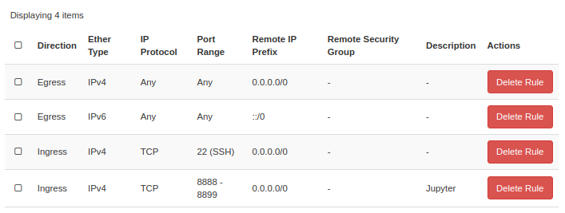

# How to Access Jupyter Server
 In this example, our floating IP is `130.238.29.56` and static IP is `192.168.2.21`. There are 2 ways to access Jupyter Server; Opening ports or port forwarding.
## 1. Opening Appropriate Ports
1. Open port that Jupyter listens to (Defaults to 8888).
   
    

2. Run Jupyter server using the following command.
    ```bash
    jupyter notebook --ip=192.168.2.21
    ```
3. Access Jupyter from remote browser using floating IP.
    ```
    http://130.238.29.56:8888
    ```

## 2. Port Forwarding

 We'll forward port `8888` from server to port `1234` of local machine. There are 2 ways this can be done; using inline command or `config` file.
1. ### Inline port-forwarding.
   
   Enter inline port-forwarding `ssh` command
    ```bash
    ssh -i [path_to_private_key] -L 1234:localhost:8888 ubuntu@130.238.29.56
    ```

    After that, run `jupyter notebook` on server and access `localhost:1234` from local browser.
2. ### Setting up `config` file at `~/.ssh/config` as follows.
   ```bash
   Host snic
       HostName 130.238.29.56
       User ubuntu
       IdentityFile [path_to_private_key]
       LocalForward 1234 localhost:8888
   ```
   After that, run `ssh snic` and `jupyter notebook` then access `localhost:1234` from local browser.  